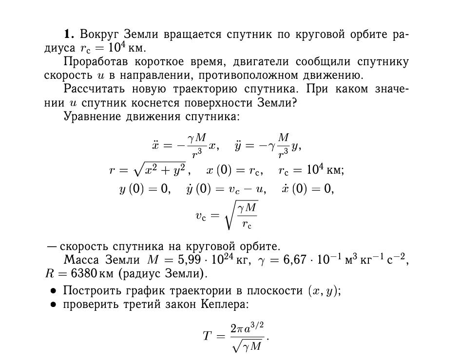
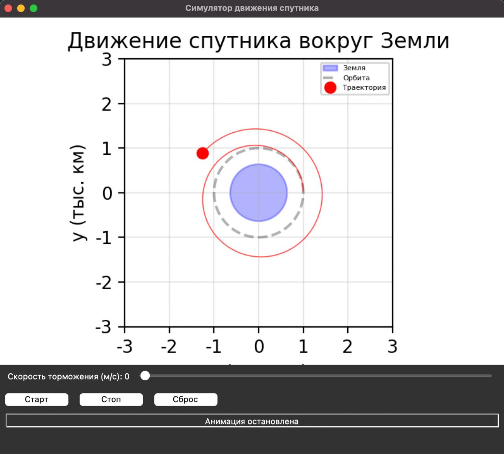
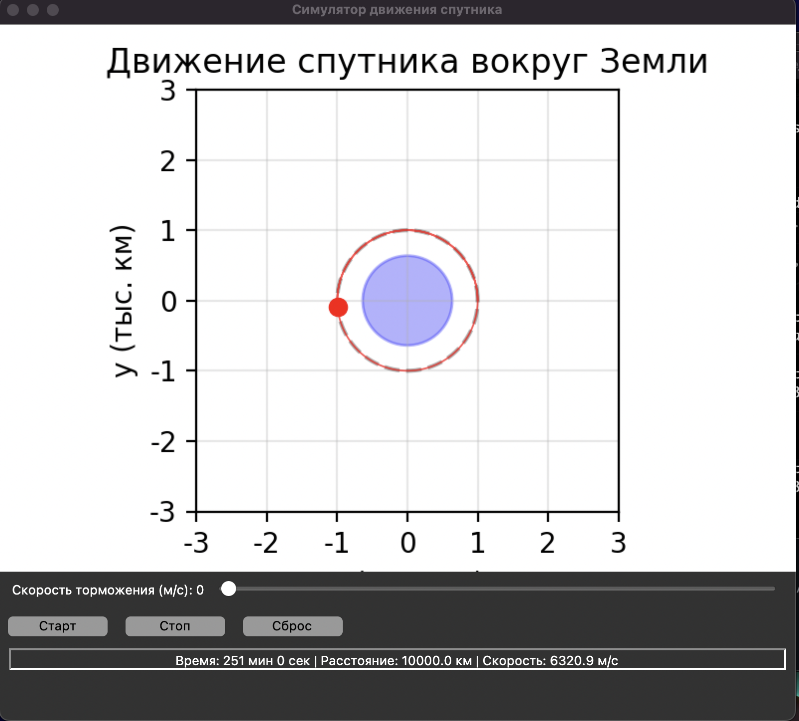

Добрый день!

В данном репозитории содержатся два файла с визуализацией решения задачи из книги "Вычислительная математика для физиков". Эта задача решалась командно, однако написанием кода к этой задаче занимался полностью я, используя DeepSeek для написания сотни строк GUI.

Вот условие:

Задача дана как небольшая проектная практика в университете НИЯУ МИФИ. Она простая, но в процессе работы я вынес пару очень важных выводов, которыми я и поделюсь здесь.

Как было указано ранее, я попросил DeepSeek написать решение, которое приведено в файле tracer_euler. Запустив программу обнаруживается, что спутник, который в исходных условиях должен двигаться по круговой орбите,просто улетает от планеты!

 

И это нормально! Да, не является тем, что я ждал, но верным с точки зрения численных методов. Почему? Все довольно просто. Численные методы имеют расхождения от аналитического решения дифференциального уравнения, коим и является уравнение движения спутника. Наглядный пример расхождения и точность я укажу в другом репозитории, там будет решение ОДУ численным методом с целью изучения расхождений (см. fillipov793). Но все же, это не годится на визуализацию. 

В чем же проблема? Можно ли сделать точнее? Да. Давайте разберемся в деталях. 

Нейросеть предложила решение, используя схему Эйлера, крайне неточную, но простую. Она основана на вычислении на индуктивном вычилении значения функции в точке, основываясь на интервале по времени dt, значении функции и производной в предыдущей точке. Этот метод якобы квадрирует график, но крайне неточно. Самый простой способ сделать визуализацию более понятной- уменьшения интервала по времени dt. Да, это работает, но расхождение остается.

Сделаем грамотнее. Заменим численный метод на более точный, например метод Рунге-Кутта четвертого порядка. Вот оно! я не отрицаю того, что расхождение, пусть небольшое, но будет, если оставить компьютер на время, но в разы меньшее, чем можно принебречь, так как такое решение почти совпадает с аналитическим, т.е. все выводы, полученные по ходу решения на бумаге применимы к визуализации. Будем считать визуализацию достаточно точной в данном случае.

